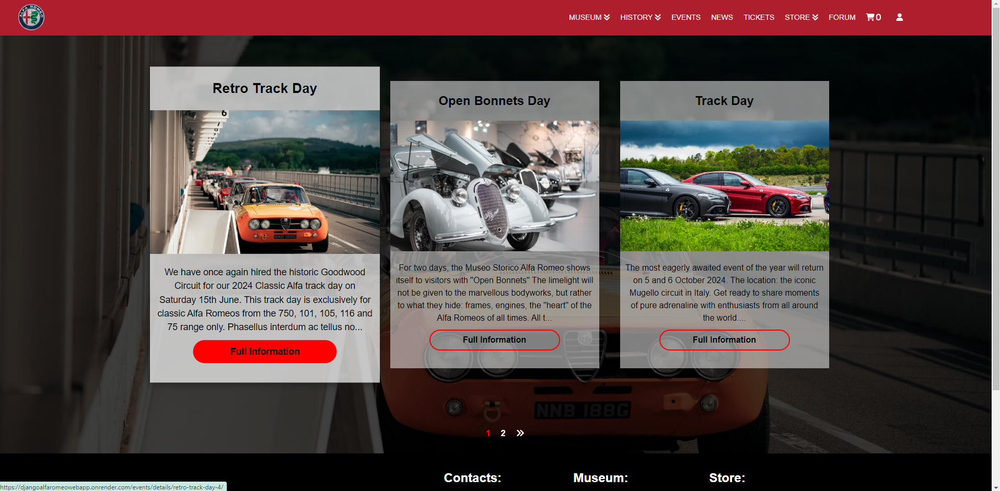
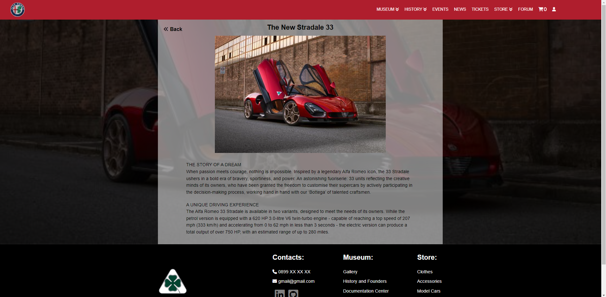
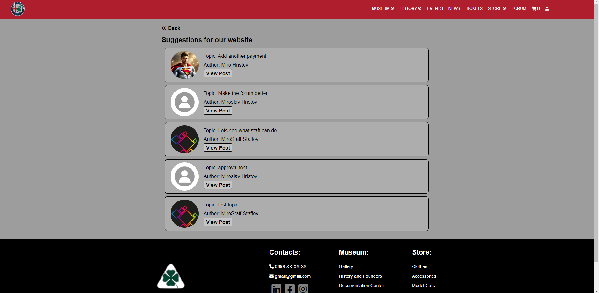
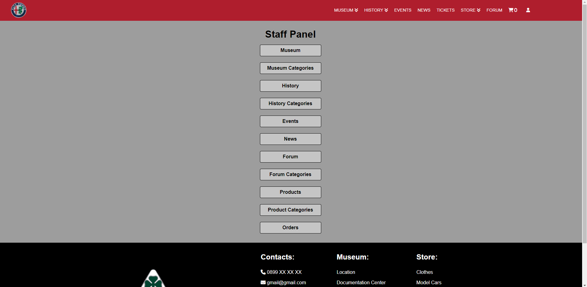
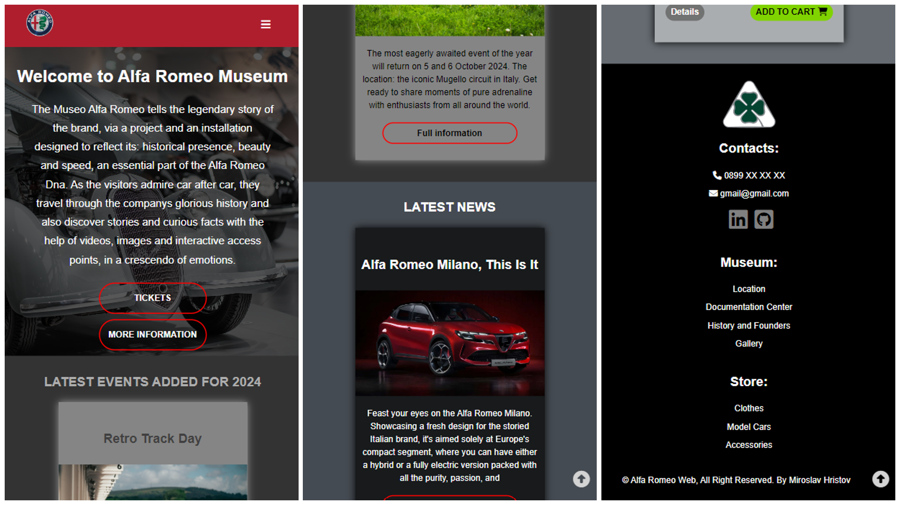
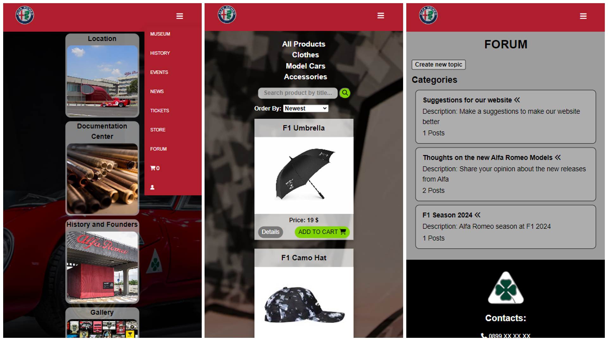
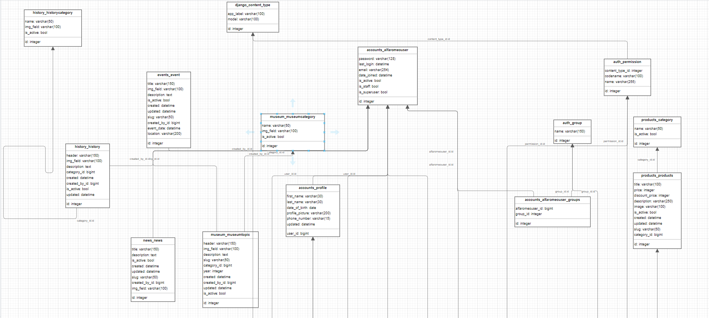

This website is a dedicated endeavor for educational purposes, serving as my Software University Project. As an avid Alfa Romeo enthusiast, I've poured my passion into this project. Please note that all images and information utilized are strictly for study purposes.  

Bringing my vision to life after nearly two years of anticipation, this project marks not the end, but just the beginning of showcasing my capabilities. Utilizing a plethora of technologies including Python, Django, REST, API, JavaScript,DOM, and HTML&CSS, I've meticulously implemented every feature essential for a fully functional website. From a dynamic news feed to immersive events and engaging forums, culminating in a robust store page capable of handling payments, this project showcases the breadth of my expertise and dedication. It's not just a website, it's a testament to my growth and passion for web development!  

# Django-Alfa-Romeo-Web-App

1. Main page:  
	- It has different Navigation bar for users and non users.  
	- Few of the links have dropdown menus that come dinamicly from the models.  
	- Depends on the users authorization, under user icon there is drop down with different functionality for normal user/ superuser/ staff.  
	- Scrolling down the main page there is Events,News,Store that shows the last 3 of each that were added in the models.  
	

2. Museum page:    
	- Has few categories.  
	- Each category here uses the same HTML but different CSS.  
	- Gallery has ordering and also pagination where you can check all the models by year or model name.  
	- History and Founders + Documentation is pretty much just text.  

3. History page:  
	- Has few categories.  
	- All pages here are pretty much the same as the 2nd screenshot.  

4. Events page:  
	- Shows the latest added events and News.  
	- Clicking on Each Event you can view more information about it.  

5. News Page (Djanog REST):  
	- This section has been done with Django REST + API calls in JS.  
	- Shows the latest added events and News.   
	- Clicking on Each New you can view more information about it.  

6. Tickets and Store page:  
	- Has a Search Field where you can search a product by title.  
	- Shows all Product Categories where you can select each category and also sort them by Price, Date Added.  
	- Pagination has been used to show 8 products per page.  
	- Only logged user have access to add products to their cart, others have to sign in.  

7. Shopping Cart / Checkout page:  
	- The added items from Store, show up here, where you can add, remove them, displays full order details.  
	- Checkout Pages Require Names and Adress Info.  
	- Paymen handlet with PayPal. After successful payment you return to website where it tells you the payment was successful.  

8. Forum Page:  
	- Prety much works as a normal Forum, it has categories, you can add a new topic to each category, there are also comments.  
	- Forum can be accessed only by registered users, since registrations requires only Email and Password, the forum also requirest First and Last Name so you can log inside it and view the forum. Redirects you to a page where it tells you that you have to enter you Names.  
	- Posts have to be approved from Moderator or Administrator before they can be viewed.  
	- Posts also can be closed, so people can view them, but can't add a comment.  

9. Profile:
	- Has edit profile, change password, delete profile functionality.   
	- Register successful email.  

10. Staff Panel:
	- Moderators and Admin can handle almost everything through this staff panel, where they can create,edit,delete,make active or inactive events, news, products, forum posts and etc.  
	- Moderators and Admin can also view from here the comments for every post and remove the comments that are not wanted.  
	- Closed, active, not active topics can be viewed from here.  

11. Mobile Responsive Design:

  

  

12. Database Entity Relationship Diagram (ERD):  

  

  

  

13. TODO:    
	- Unit testing.  
	- Deploy.    
	- Make better README.  

## Run this project locally

1. Clone repo: https://github.com/miroslav-valsorim/Django-Alfa-Romeo-Web-App.git  
2. Install requirements.txt: `pip install -r requirements.txt`  
3. DB:  
	- You can use the already done DB in folder sqlite3_pycharm (in case that the db in project folder is not available) with `superuser miro@abv.bg` `pass: miro`    
	- Or you can migrate and make new DW:  `python manage.py migrate` and create superuser `python manage.py createsuperuser`  

## License

[MIT License](LICENSE)