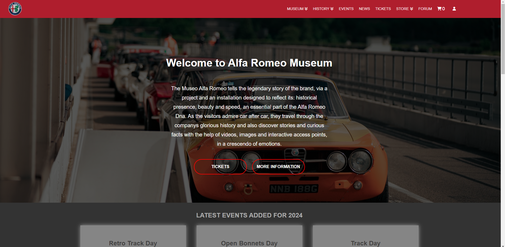
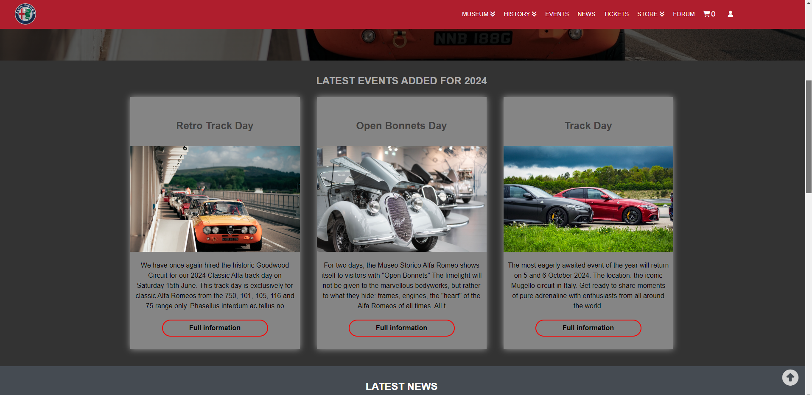
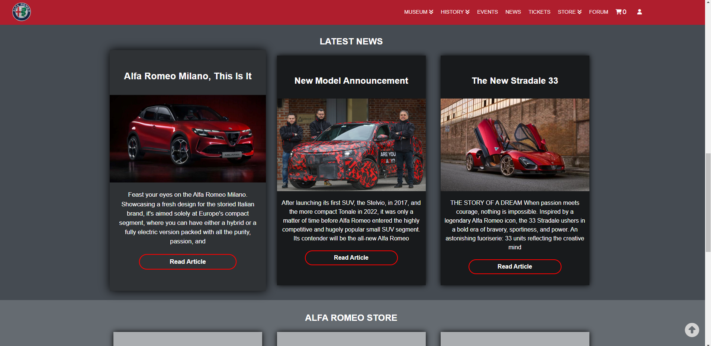
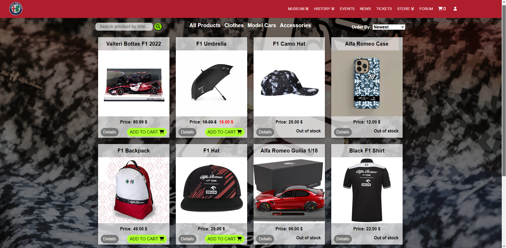
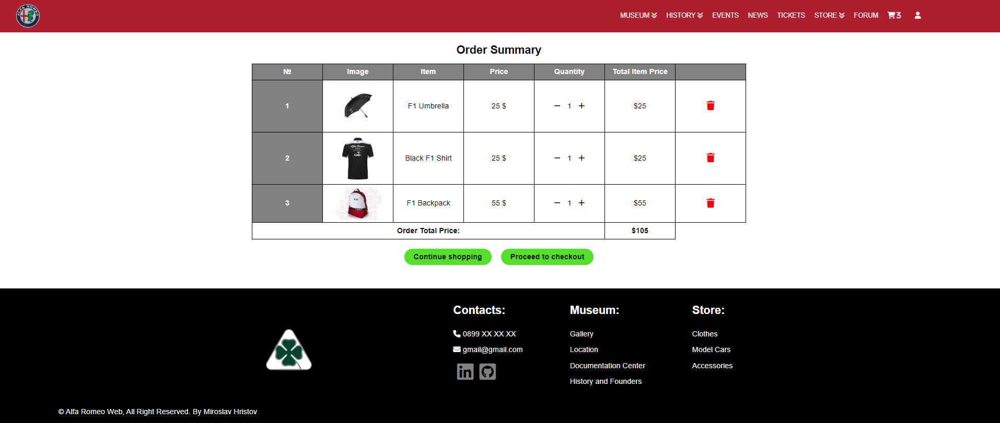
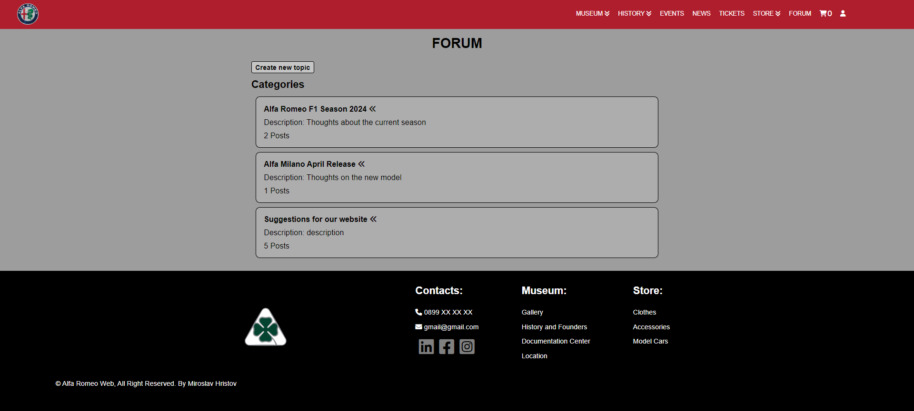
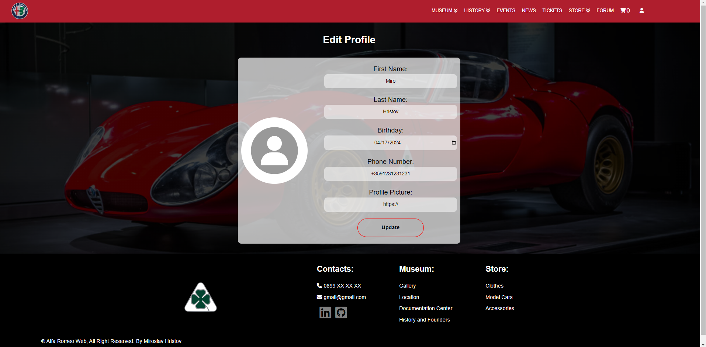
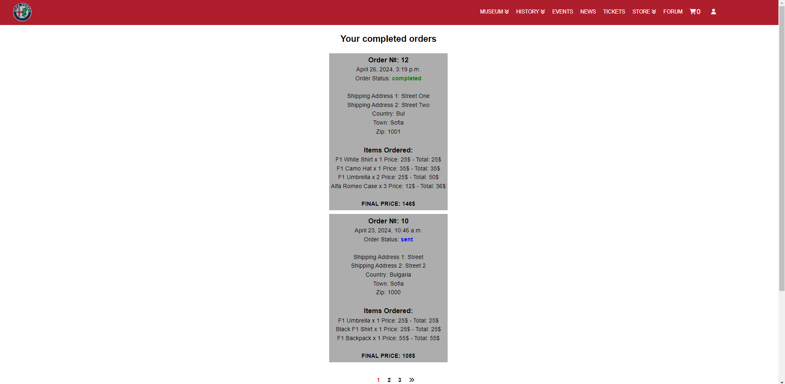
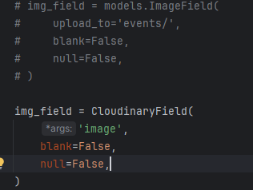

# Django-Alfa-Romeo-Web-App  

Rednder link: https://djangoalfaromeowebapp.onrender.com/

Azure link: https://alfaromeo.azurewebsites.net/

## Introduction  

This website is a dedicated endeavor for educational purposes, serving as my Software University Project. As an avid Alfa Romeo enthusiast, I've poured my passion into this project. PLEASE NOTE THAT ALL IMAGES AND INFORMATION UTILIZED ARE STRICTLY FOR STUDY PURPOSES.   


Bringing my vision to life after nearly two years of anticipation, this project marks not the end, but just the beginning of showcasing my capabilities. Utilizing a plethora of technologies and methodologies including Python, Django, REST, API, JavaScript, DOM, HTML&CSS, Testing, Automation with CI/CD, Dockerizing the application. Applying Infrastructure as a Code via Terraform. Deployed to both Azure and Render. I've meticulously implemented every feature essential for a fully functional website. From a dynamic news feed to immersive events and engaging forums, culminating in a robust store page capable of handling payments, this project showcases the breadth of my expertise and dedication. It's not just a website, it's a testament to my growth and passion for web development!  


## Features  

1. Main page:  
	- It has different Navigation bar for users and non users.  
	- Few of the links have dropdown menus that come dinamicly from the models.  
	- Depends on the users authorization, under user icon there is drop down with different functionality for normal user/ superuser/ staff.  
	- Scrolling down the main page there is Events,News,Store that shows the last 3 of each that were added in the models.  
	







2. Museum page:    
	- Has few categories.  
	- Each category here uses the same HTML but different CSS.  
	- Gallery has ordering and also pagination where you can check all the models by year or model name.  
	- History and Founders + Documentation is pretty much just text.  


3. History page:  
	- Has few categories.  
	- All pages here are pretty much the same as the 2nd screenshot.  


4. Events page:  
	- Shows the latest added events and News.  
	- Clicking on Each Event you can view more information about it.  


5. News Page (Djanog REST):  
	- This section has been done with Django REST + API calls in JS.  
	- Shows the latest added events and News.   
	- Clicking on Each New you can view more information about it.  


6. Tickets and Store page:  
	- Has a Search Field where you can search a product by title.  
	- Shows all Product Categories where you can select each category and also sort them by Name, Price ASC, Price DESC, Date Added.  
	- Track if items are in stock or out of stock.  
	- Pagination has been used to show 8 products per page.  
	- Only logged user have access to add products to their cart, others have to sign in.  





7. Shopping Cart / Checkout page:  
	- The added items from Store, show up here, where you can add, remove them, displays full order details. 
	- Keeping track of producst quantity.   
	- Checkout pages require First, Last names, phone number and adress info.  
	- Paymen handled with PayPal. After successful payment you return to website where it tells you the payment was successful.  
	- Recieve email on successful order.  
	- TODO: Hanlde better successful and unsuccessful payments. (more info shared on checkout view)  




  

8. Forum Page:  
	- Prety much works as a normal Forum, it has categories, you can add a new topic to each category, there are also comments.  
	- Forum can be accessed only by registered users, since registrations requires only Email and Password, the forum also requirest First and Last Name so you can log inside it and view the forum.The purpose of this is to not share emails directly in the forum and keep the users just with their names/ nicknames for privacy. Redirects you to a page where you have to enter you names if you haven't entered them yet.  
	- Posts have to be approved from Moderator or Administrator before they can be viewed. This approval happens in the staff or admin panel.  
	- Posts also can be closed, so people can view them, but can't add a comment.  





  

9. Sign in:  
	- Register, Log in, Reset Password.  

  

  

  

10. Profile:
	- Has edit profile, change password, delete profile functionality.   
	- Register successful email.  
	- Check completed orders.  
	- Admin and Moderators have extra 2 links for Admin and Staff Panel.  






11. Staff Panel:  
	- Moderators and Admin can handle almost everything through this staff panel, where they can create,edit,delete,make active or inactive events, news, products, forum posts, orders and etc.  
	- Moderators and Admin can also view from here the comments for every post and remove the comments that are not wanted.  
	- Closed, active, not active topics can be viewed from here.  
	- Approval for forum topics can happen through here.  
	- Check orders done, their status, update order status, prepare orders for shipping, etc.   


12. Mobile Responsive Design:

  

  

13. Database Entity Relationship Diagram (ERD):  

  

  

   

14. Unit and UI tests  

[](https://github.com/miroslav-valsorim/Django-Alfa-Romeo-Web-App/actions/workflows/django.yml)

15. Docker:  

   

  

   

	- Check settings.py DB settings comments
	- Check Dockerfile
	- Chekc Docker-Compose.yml
	- Check entrypoint.sh
	- Build docker-compose.yml locally   
		```
		docker-compose build
		```  
	- Run docker-compose.yml (Run the server and db)  
		```
		docker-compose up -d
		```   
	- Create superuser so you can add/create/delete and work with the DB
		```
		docker exec -it CONTAINER_ID python manage.py createsuperuser 
		```   
	- Source that helped me a lot dockerizing my application ( with few changes here and there)
		```
		https://testdriven.io/blog/dockerizing-django-with-postgres-gunicorn-and-nginx/
		```
	- After connection check DB with those commands  
		```
		docker exec -it [postgre_container_id] /bin/bash
		psql -U hello_django -d hello_django_dev
		/dt
		```
   

   

16. Azure:

	- More information about deploying to Azure [here](https://github.com/miroslav-valsorim/Django-Alfa-Romeo-Web-App/tree/main/azure_deployment/README.md)


17. Render:

	- More information about deploying to Render [here](https://github.com/miroslav-valsorim/Django-Alfa-Romeo-Web-App/tree/main/render_deployment/README.md)

18. Terraform (Infrastructure as a code):

	- More information [here](https://github.com/miroslav-valsorim/Terraform-IaaC-Alfa-Romeo-Web-App) and [here](https://github.com/miroslav-valsorim/Django-Alfa-Romeo-Web-App/tree/main/infrastructure_as_a_code_Terraform)

## Tech Stack Used

1. Python  
2. Django, Django REST  
3. API  
4. JS  
5. HTML&CSS  
6. DOM  
7. Github Actions (CI/CD)
8. Docker
9. Cloud (Azure, Render)
10. Terraform (IaaC)

## Run this project locally

1. **Clone repo:** 
    ```
    git clone https://github.com/miroslav-valsorim/Django-Alfa-Romeo-Web-App.git 
    ```
   
2. **Install requirements.txt:** 
    ```
    pip install -r requirements.txt
    ```

3. **DB:**
    1. **First choice:**
        - You can use the already done DB in folder sqlite3_pycharm with `superuser: miro@abv.bg` `pass: miro`.   
        - In this case, you have to use the imageField in all the models. Which means you have to comment out the CloudinaryField and uncomment the Image field. Both should be replaced.  
              
        - Also just in case, you have to delete the last migrations from all the models that have used Cloudinary image fields.  
              

    2. **Second choice:**
        - If you don't want to use Cloudinary, follow the steps two and three from 3.1.  
        - If you want to use Cloudinary, you can continue to the next step (in this case, you can use the already done db in the project in the alfa_romeo_web folder, with the same credentials from step 3.1).  
        - Migrate and make a new DB:  
            ```
            python manage.py migrate
            ```
            and create a superuser:  
            ```
            python manage.py createsuperuser
            ```

    3. If some issue with the DB, remove the If-else statement and push the sqlite3 (or whatever DB you want to use) DB one tab to the left.  
          

4. Set ALLOWED_HOSTS.  

5. Check envExample.txt in alfa_romeo_web/envs/...  

## Project defence and certificate

   

## License

[MIT License](LICENSE)