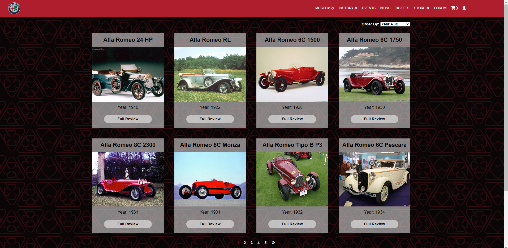
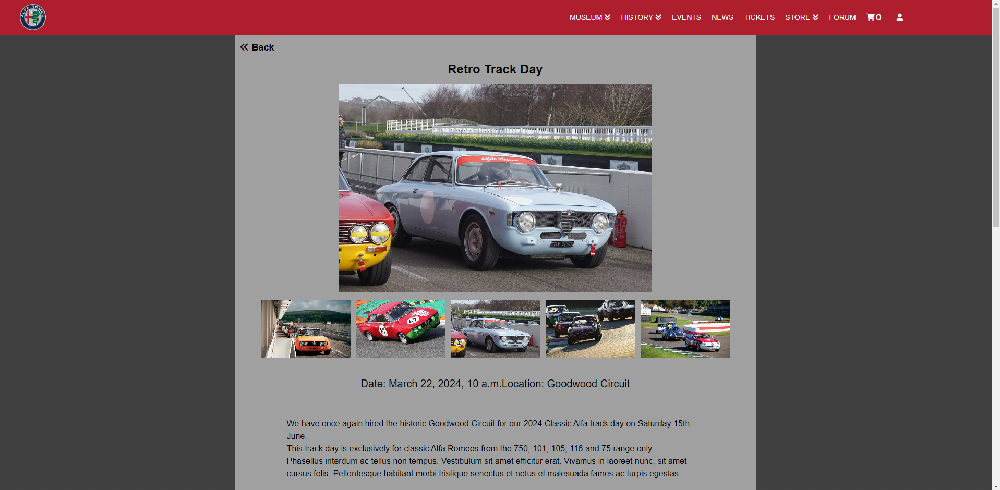
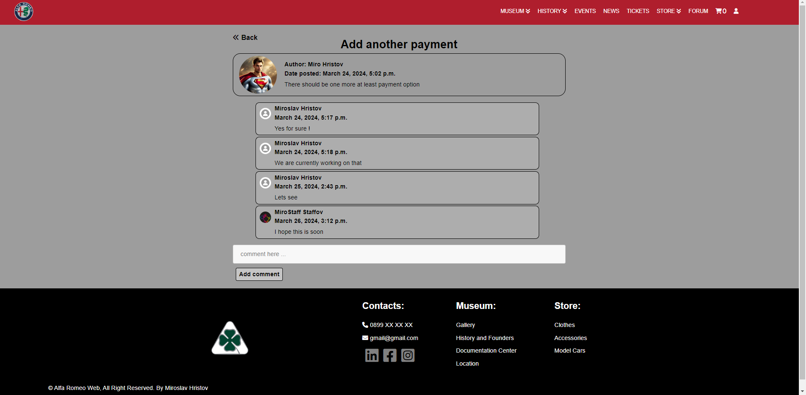

The Website is done only for study purposes. Since I'm Alfa Romeo fan that's my Softwate University Project !

# Django-Alfa-Romeo-Web-App

1. Main page:  
	- It has different Navigation bar for users and non users.  
	- Few of the links have dropdown menus that come dinamicly from the models.  
	- Depends on the users authorization, under user icon there is drop down with different functionality for normal user/ superuser/ staff.  
	- Scrolling down the main page there is Events,News,Store that shows the last 3 of each that were added in the models.  
	

2. Museum page:    
	- Has few categories.  
	- Each category here uses the same HTML but different CSS.  
	- Gallery has ordering and also pagination where you can check all the models by year or model name.  
	- History and Founders + Documentation is pretty much just text.  

3. History page:  
	- Has few categories.  
	- All pages here are pretty much the same as the 2nd screenshot.  

4. Events and News page:  
	- Shows the latest added events and News.  
	- Clicking on Each Event/News you can view more information about it.  

5. Tickets and Store page:  
	- Has a Search Field where you can search a product by title.  
	- Shows all Product Categories where you can select each category and also sort them by Price, Date Added.  
	- Pagination has been used to show 8 products per page.  
	- Only logged user have access to add products to their cart, others have to sign in.  

6. Shopping Cart / Checkout page:  
	- The added items from Store, show up here, where you can add, remove them, displays full order details.  
	- Checkout Pages Require Names and Adress Info.  
	- Paymen handlet with PayPal. After successful payment you return to website where it tells you the payment was successful.  

7. Forum Page:  
	- Prety much works as a normal Forum, it has categories, you can add a new topic to each category, there are also comments, the superuser or staff should approve every post before it shows up on web page.  
	- Forum can be accessed only by registered users, since registrations requires only Email and Password, the forum also requirest First and Last Name so you can log inside it and view the forum. Redirects you to a page where it tells you that you have to enter you Names.  

8. TODO:  
	- Currently Working on adding Staff Pages to edit, create, delete all the functionality above.  
	- Profile Templates have to be done better.  
	- Unit testing.  
	- Mobile responsive design.  
	- Make better README.  
