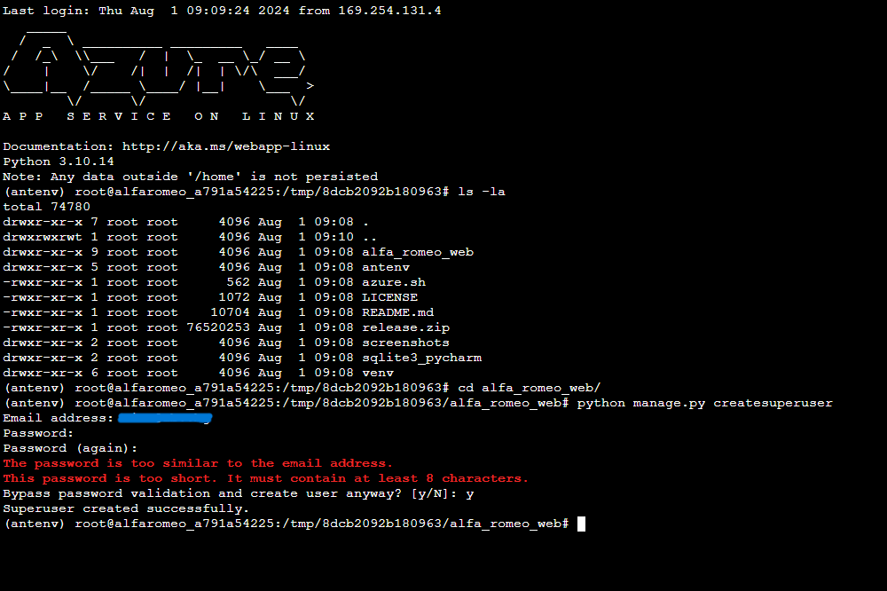

# Azure Deployment Settings

Due to the different structure that my project has and it's 1 folder nested inside, there have to be set differently from the 'normal' setup

## Steps and comments

1. Select WebApp + Database:  

    -    

    -     

    - After Project is done it has to look like this   

    -    

2. Set Environment Variables:   

    -    

3. Set Start Command:   

    - Check azure.sh inside the project that's in the root project

    -    

4. Deploy the project from GitHub   

    -    

5. Go to SSH and create Superuser (log inside the vm)   

    -    

    - first use ```cd alfa_romeo_web```

    - 

    - ```python manage.py createsuperuser```

6. Open Web Page

    - 