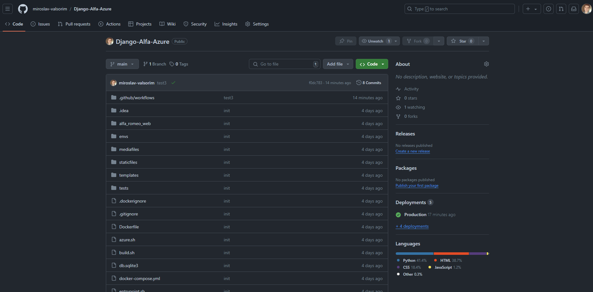
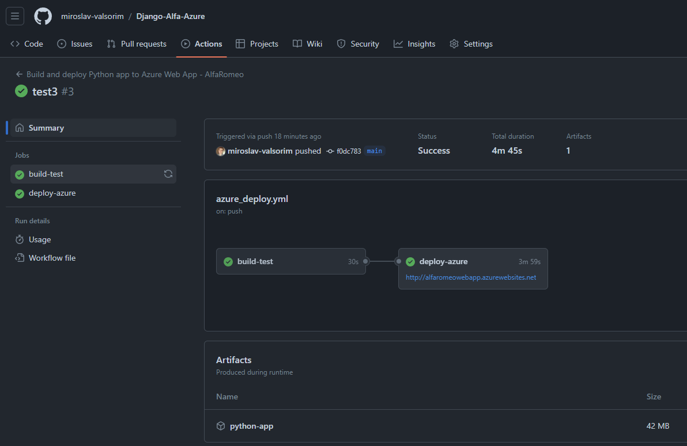
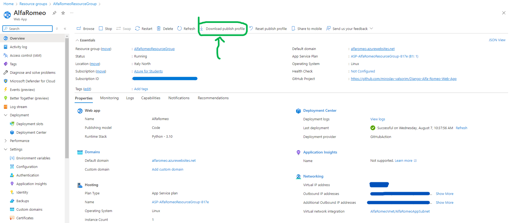

# Infrastructure as a code via Terraform and applying the code changes after the Infrastructure is done

## Terraform repo [here](https://github.com/miroslav-valsorim/Terraform-IaaC-Alfa-Romeo-Web-App)    

I've deployed a copy of the original project via Terraform and a few workflows via GitHub. At some point the copy project would be deleted (screenshot N2). But the workflow and the whole Infrastructure will apply to the original project without any changes !

Screenshot N4 shows where you can get the AZUREAPPSERVICE_PUBLISHPROFILE, download the file and copy it as it is!   

  

  

  
 
  