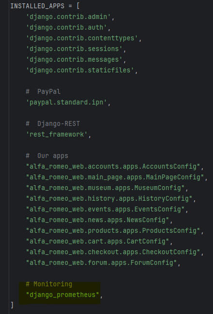
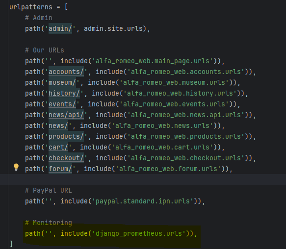
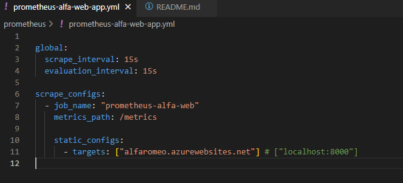
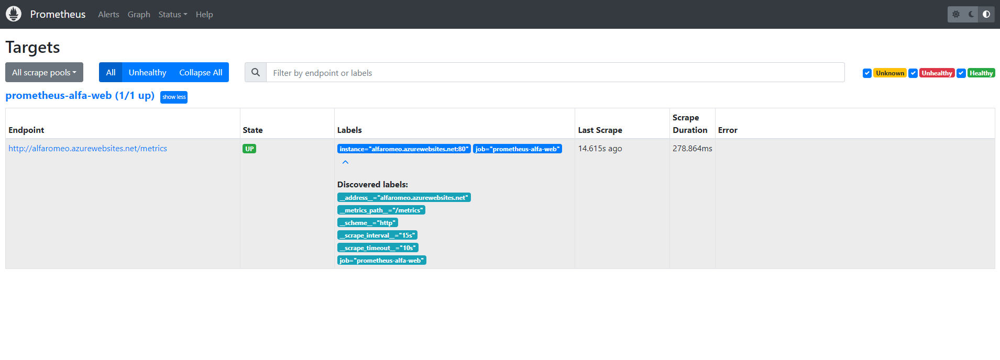
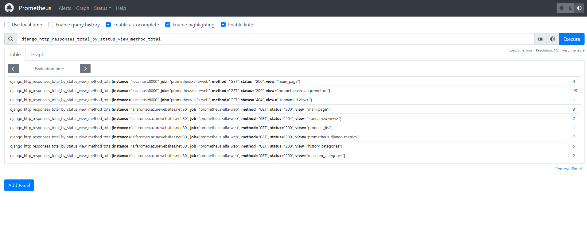
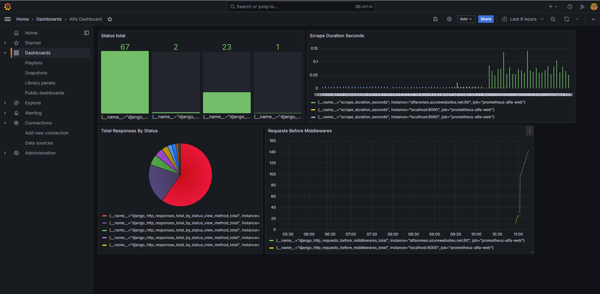

# Monitoring Via Prometheus and Grafana

## Steps to go through

1. Download Prometheus  

2. In the project run ```pip install django-prometheus```  

3. Add it to INSTALLED_APPS  



4. Add it to the MIDDLEWARE  


5. Add it to the main project urlpatterns  



6. Create the yml file to run your prometheus with the config ```prometheus.exe --config.file=prometheus-alfa-web-app.yml```  



## Result

   

     
    
   
  

