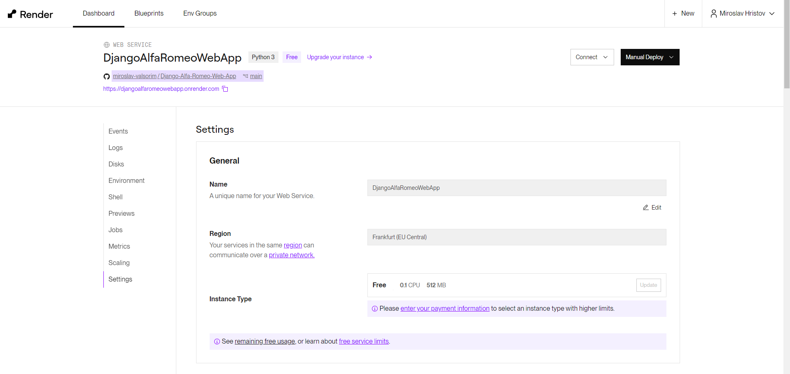
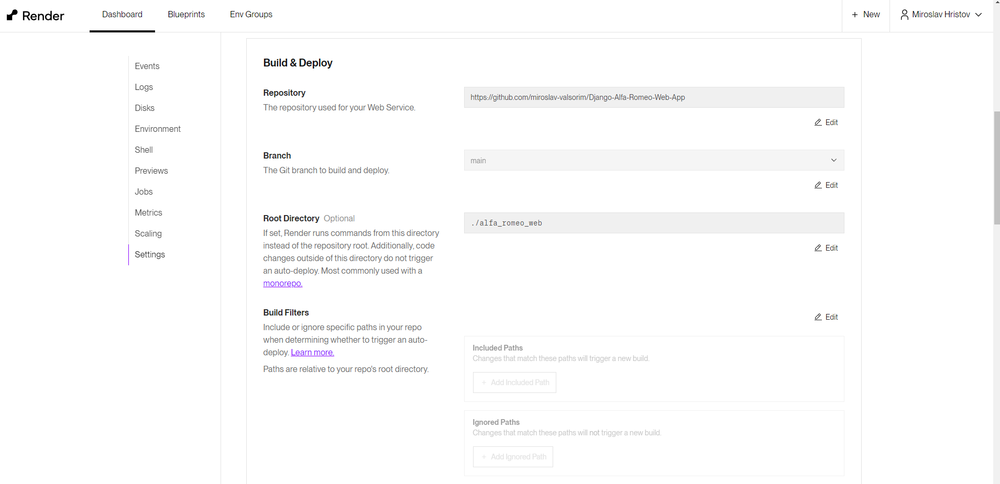
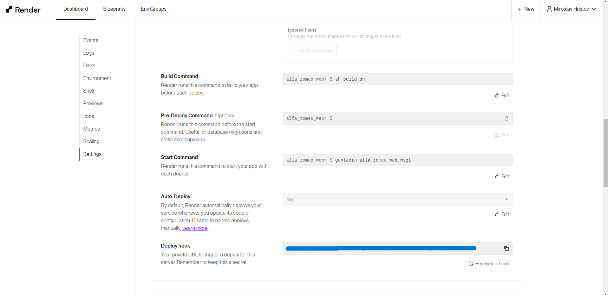
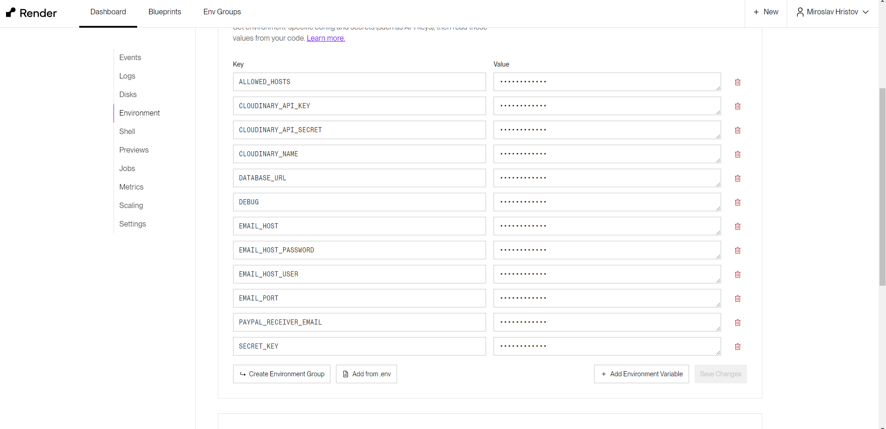
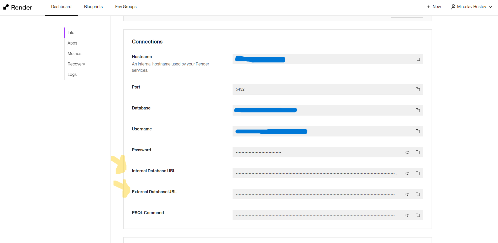
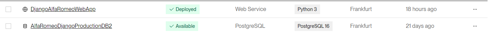

# Render Deployment Settings

Due to the different structure that my project has and it's 1 folder nested inside, there are few things that have to be set differently from the 'normal' setup

## Steps and comments

1. Create Web App:  

    - After it's done it has to look like the screenshots below. We set alfa_romeo_web folder as root due to the different project structure! (Else it wouldn't need root folder setup)

    - Check build.sh in the project

    - Connect to the DB locally or add both commands to the build.sh > makemigrations, because of the PayPal ipn, after that migrate!

    -    

    -      
    
    -    
  

2. Set Environment Variables:   

    -    

3. Create PostgreSQL DB:   

    - You can either use Internal or External DATABASE_URL to set the DB into the Web Service Environment Variables !

    - After DB is created, set it locally and create admin user ```python manage.py createsuperuser```

    -    

4. Last:  

    - At the end both services should look like the screenshot below  

    - 


